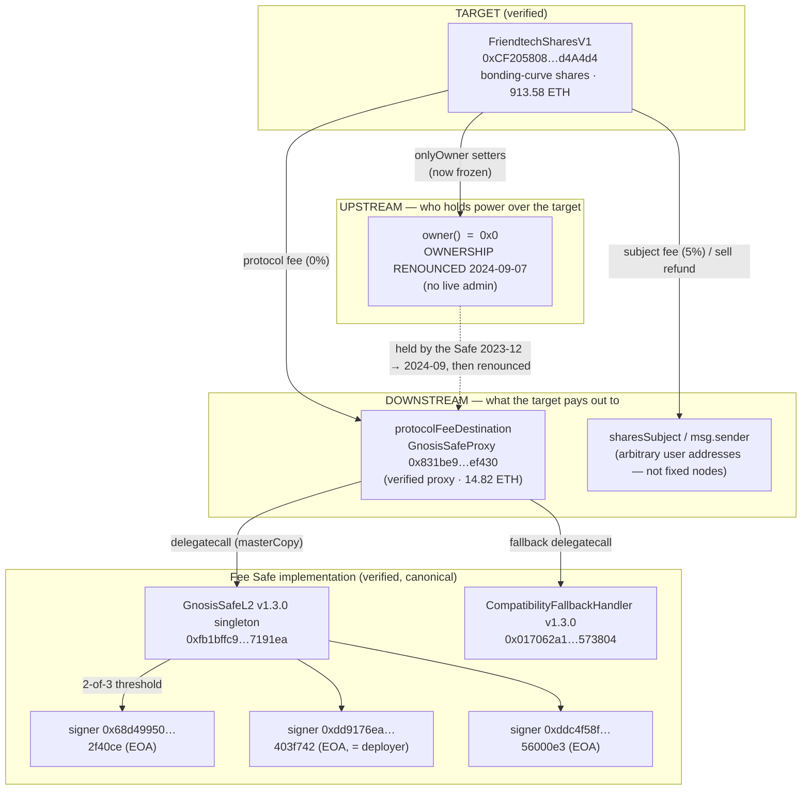

# friend.tech V1 — Security Audit Source Bundle

Audit-ready repository for **`FriendtechSharesV1`** and its complete on-chain trust graph.
Everything an auditor needs to reason about the target's security is present as readable
source; anything that cannot be made readable on-chain is named explicitly in
[`UNRESOLVED.md`](./UNRESOLVED.md).

> Scope note: this repo **maps and recovers** the system. It deliberately does **not** judge
> exploitability — that is the next step. Statements below are factual descriptions of what the
> code and chain state are, not verdicts on whether they are safe.

---

## 1. Target

| | |
|---|---|
| Name | `FriendtechSharesV1` |
| Address | [`0xCF205808Ed36593aa40a44F10c7f7C2F67d4A4d4`](https://basescan.org/address/0xCF205808Ed36593aa40a44F10c7f7C2F67d4A4d4) |
| Chain | **Base mainnet** (chainId `8453`) |
| Verified | Yes — Solidity `0.8.18`, optimizer **off**, not a proxy |
| Deployed | 2023-08-10 06:50 UTC, block `2430440`, tx `0xa7eba644…d14c01` |
| Deployer | `0xdd9176eA3E7559D6B68b537eF555D3e89403f742` (also a signer on the fee Safe — see §4) |
| Native balance | **913.58 ETH** (the bonding-curve reserve), as of snapshot block `50120188` |
| Source in repo | [`contracts/01-target-FriendtechSharesV1/`](./contracts/01-target-FriendtechSharesV1/) |

### What it does (the mechanism)
`FriendtechSharesV1` is a self-contained **bonding-curve "shares" market**. Each `sharesSubject`
(an address, one per friend.tech account) has a supply curve. Anyone can `buyShares`/`sellShares`
of any subject; price is a pure quadratic function of supply (`getPrice` → `supply² / 16000` ETH,
integrated). Balances and supply are **internal ledger mappings** — there is **no ERC-20 token**,
nothing transferable, and no `approve`. The contract holds native ETH as the reserve that backs
the curve.

Fees on each trade:
* **protocol fee** → `protocolFeeDestination` (currently **0 %** — see §5)
* **subject fee** → the `sharesSubject` itself (currently **5 %**)

ETH movement facts (structural, for the auditor to weigh):
* ETH **enters** only via `buyShares` (buyer overpays `price + fees`; `price` is retained as reserve).
* ETH **leaves** only via `sellShares` (`price − fees` to the seller) and the two fee transfers.
* There is **no** `withdraw`, **no** `selfdestruct`, **no** `delegatecall`, **no** admin sweep.
  The reserve is reachable only by selling back down the curve.
* Every payout is a raw `.call{value:}` to a caller-influenced address
  (`msg.sender`, `sharesSubject`, `protocolFeeDestination`). State (`sharesBalance`, `sharesSupply`)
  is updated **before** those calls in both `buyShares` and `sellShares`. (Recorded as a fact; not assessed here.)

---

## 2. Trust graph

The graph is **small and fully resolved**. The contract handed over reaches exactly one other
on-chain contract (its fee destination), which is a Gnosis Safe proxy that resolves to two more
canonical contracts, controlled by three EOA signers. Nothing else is reachable in either direction.



### Node index — every contract in the graph, and where its code lives

| # | Contract | Address | Status | Location in repo |
|---|----------|---------|--------|------------------|
| 1 | `FriendtechSharesV1` (target) | `0xCF205808…d4A4d4` | Verified (solc 0.8.18) | [`contracts/01-target-FriendtechSharesV1/`](./contracts/01-target-FriendtechSharesV1/) |
| 2 | `GnosisSafeProxy` (fee destination shell) | `0x831be9…ef430` | Verified (solc 0.7.6) | [`contracts/02-feeDestination-GnosisSafeProxy/`](./contracts/02-feeDestination-GnosisSafeProxy/) |
| 3 | `GnosisSafeL2` v1.3.0 (Safe implementation) | `0xfb1bffc9…7191ea` | Verified · byte-identical to canonical upstream | [`contracts/03-safe-singleton-GnosisSafeL2-v1.3.0/`](./contracts/03-safe-singleton-GnosisSafeL2-v1.3.0/) |
| 4 | `CompatibilityFallbackHandler` v1.3.0 | `0x017062a1…573804` | Verified · byte-identical to canonical upstream | [`contracts/04-fallbackHandler-CompatibilityFallbackHandler-v1.3.0/`](./contracts/04-fallbackHandler-CompatibilityFallbackHandler-v1.3.0/) |
| — | Fee-Safe signers ×3 | see §4 | **EOAs** (no code) | recorded in [`state/authority.md`](./state/authority.md) |
| — | `owner()` | `0x0` | renounced | recorded in [`state/authority.md`](./state/authority.md) |

**No contract in the value path is unverified.** No decompilation was required — see
[`UNRESOLVED.md`](./UNRESOLVED.md) for why the "recover an opaque blob" workflow does not apply here,
and for the two off-chain / key-holder items that genuinely remain open.

---

## 3. Repository layout

```
README.md                     ← this map
UNRESOLVED.md                 ← explicit list of what is NOT readable on-chain (+ evidence)
contracts/                    ← full source of every node, as real compilable files
  01-target-FriendtechSharesV1/          (split files + as-verified flat + abi + metadata)
  02-feeDestination-GnosisSafeProxy/
  03-safe-singleton-GnosisSafeL2-v1.3.0/  (full Safe 1.3.0 source tree)
  04-fallbackHandler-CompatibilityFallbackHandler-v1.3.0/
bytecode/                     ← on-chain runtime bytecode of each node + target creation bytecode
state/
  authority.md                ← live roles, owners, renounce timeline, proxy pointers, balances
  configuration.md            ← live parameter values + frozen-ness + evidence
  raw-rpc/                    ← raw JSON: getsourcecode, storage/eth_call snapshot, events, sim
integrity/
  README.md                   ← integrity findings + method
  upstream-openzeppelin/      ← genuine OZ Context v4.4.1 / Ownable v4.7.0 used for the diff
  upstream-safe-1.3.0/        ← canonical Safe 1.3.0 deployedBytecode (npm) used for the diff
```

---

## 4. Authority state (who holds power right now)  →  [`state/authority.md`](./state/authority.md)

* **Target admin: NONE.** `owner()` is the **zero address** — ownership was **renounced**.
  On-chain history (`OwnershipTransferred`):
  1. 2023-08-10 — `0x0` → deployer `0xdd9176ea…403f742`
  2. 2023-12-02 — deployer → **fee Safe** `0x831be9…ef430`
  3. **2024-09-07 — fee Safe → `0x0` (renounced)**
  The three `onlyOwner` setters are therefore **permanently uncallable** (proven by simulation, §6).
* **Fee-destination Safe:** a **2-of-3 Gnosis Safe v1.3.0**, `nonce = 39`, **no modules, no guard**.
  Signers (all EOAs):
  `0x68d499502055ab7d4927694d971de985342f40ce`,
  `0xdd9176ea3e7559d6b68b537ef555d3e89403f742` (= the target's deployer),
  `0xddc4f58f22166a88b9976c417046bb10d56000e3`.
  The Safe **currently has no power over the target** (owner is renounced); it is only a value
  recipient. It held admin power over the target during the window 2023-12 → 2024-09.

---

## 5. Configuration state (the live parameters)  →  [`state/configuration.md`](./state/configuration.md)

| Parameter | Live value | Note |
|---|---|---|
| `protocolFeeDestination` | `0x831be9…ef430` (the Safe) | frozen (owner renounced) |
| `protocolFeePercent` | **0** (0 %) | frozen. Historically friend.tech charged 5 %; on-chain it now reads 0 and can never change |
| `subjectFeePercent` | `5e16` (**5 %**) | frozen |
| target reserve | **913.58 ETH** | actively drawn down — most recent tx is a `sellShares` on 2026-08-17 |

The `protocolFeePercent = 0` value is worth the auditor's attention: it is coherent with the code
(no division-by-zero or underflow at 0), but means the fee Safe receives nothing from new trades,
and the state is immutable.

---

## 6. Integrity & simulation  →  [`integrity/README.md`](./integrity/README.md)

* **Target building blocks are genuine, unmodified OpenZeppelin:** inlined `Context.sol` ==
  OZ **v4.4.1**; inlined `Ownable.sol` == OZ **v4.7.0** (the project mixed OZ minor versions —
  a cosmetic quirk, no behavioral difference; both verified byte-for-byte against upstream).
* **The entire Safe stack is canonical and unmodified:** proxy, `GnosisSafeL2` singleton, and
  `CompatibilityFallbackHandler` are **byte-identical to the published `@gnosis.pm/safe-contracts@1.3.0`
  deployedBytecode**, and the singleton + fallback handler are additionally **byte-identical between
  Base and Ethereum mainnet** at the same deterministic addresses.
* **Simulation from an unprivileged address confirms:** all three `onlyOwner` setters revert with
  `"Ownable: caller is not the owner"`; `buyShares` succeeds with no signature/whitelist — the trade
  path is fully **permissionless** on-chain.

---

## 7. How this snapshot was produced (reproducibility)

* Sources: Etherscan V2 `getsourcecode` (chainId 8453) for the verified contracts.
* On-chain reads: Base JSON-RPC `https://mainnet.base.org`, pinned to block **`50120188`** where noted.
* History/provenance: Blockscout Base API (`base.blockscout.com`) for creation info & event logs.
* Cross-chain integrity: Ethereum mainnet JSON-RPC + `@gnosis.pm/safe-contracts@1.3.0` npm artifacts.
* Raw responses are preserved under [`state/raw-rpc/`](./state/raw-rpc/).
